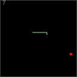

SnakeGame
=========

A rudimentary snake game implemented in JavaScript.

To play, press the A and D buttons to turn left or right.  Maneuver the snake to eat the red food pellet, after which it will grow by one unit.  Continue collecting food pellets, but don't hit the walls or any other part of the snake.

